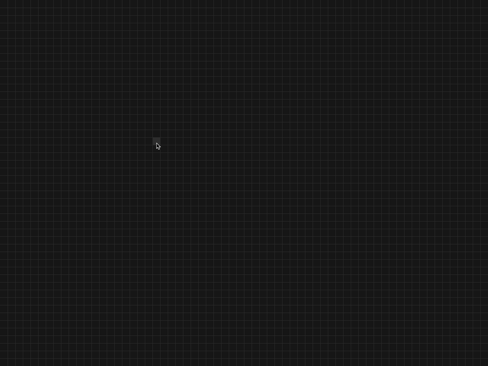

# Life Automata
C implementation of Conway's game of life with SDL2.
It's an old project from August 2022, which I never polished and published. 
Now it lives again.



# Build
make and g++ are required. SDL2 is included in the libs folder.

```bash
make
```

# Keys
- <kbd>Space</kbd> Turn on/off the simulation
- <kbd>Click</kbd> Add/remove cells from the grid. Clicking on an empty cell adds, while clicking on a living cell removes it.